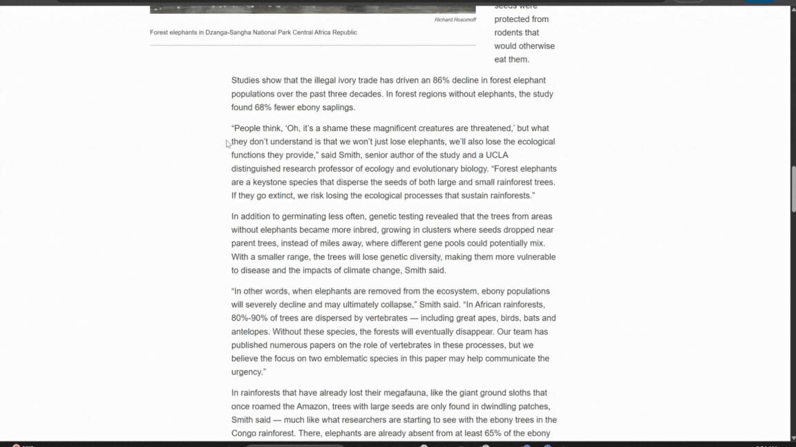

> **[View Project on Devpost - Submitted to Google Chrome Built-in AI Challenge 2025](https://devpost.com/software/noma-yjpsrf)**

**Gemox** is a chrome extension that brings context-aware AI to your cursor. Through **curated tags**, it brings your **personal context** – ideas you save while browsing, Notion pages, Pinterest boards, docs, even audio notes – straight into the conversation, wherever you’re working. No switching, no searching, no starting from scratch. Just **inline AI** that finally understands what you mean.

By default, Gemox runs **on-device** with **Gemini Nano** and uses the **Multimodal Prompt API** to support text and image inputs for providing text responses. This runs entirely **Client Side**, meaning privacy first for your data. Gemox also offers **Hybrid Server Side AI** features: To generate image outputs using your context, Gemox uses **Gemini 2.5 Flash Image** via the **Gemini Developer API**. Similarly, Gemini is used to power audio transcription, which allows you to save audio files (like Zoom Recordings) to your context. 

---

## Installation

Gemox is an **unpublished Chrome extension**, so testing requires a local installation. Please clone the repository, and load the extension into Chrome.
Go to [TESTING_GEMOX.md](TESTING_GEMOX.md) to follow the setup instructions.

---

## Basic Usage

**Creating Tags**

To create a tag, or save context to an existing tag, right-click on any selected text / image / audio file and click Save to Tag. To save PDFs, go to Gemox icon → Settings → Connect Document.



## How to Use Gemox While You Work:

| Shortcut | Action |
|----------|--------|
| `Ctrl + Q` | Open tag selector |
| `Ctrl + Space` | Generate response (text or image) |

Press `Ctrl + Q` to open Tag Selector anywhere, pick a `@tag`, type your prompt, then press `Ctrl + Space` to hit Enter. Keyboard commands are the same for Mac/Windows. You can also just type `@yourTagName` instead of selecting it via the Tag Selector.

### Tag Format
All Gemox prompts follow this structure:
```
@tagName Your Prompt
```

### Text Generation using Gemini Nano via the Multimodal Prompt API
Your Contexts can be Text Inputs:
```
@myResearchNotes Give my friend a summary of the papers I read today 
```
Your Contexts can be Image Inputs:
```
@RoomDecorIdeas Write a blog post about my best room decor pics from my Pinterest board
```
Press `Ctrl + Space` to generate a text response. This feature runs Client Side.

### Image Generation using Gemini 2.5 Flash Image via the Gemini Developer API
To generate images, use the **`Create`** keyword right after a @tag:
```
@DesignNotes Create a modern logo for my coffee shop based on all my ideas
```
Press `Ctrl + Space` to generate an image. This feature runs Server Side.


---

## Tips

### Tags not showing / Tag selector not opening on Ctrl + Q
- Reload the extension &/ refresh the page you are trying to use Gemox on!
- Gemox currently works across many platforms including Gmail, Slack, Google Colab, LinkedIn, Most Search bars, AI chats like ChatGPT, Claude & Perplexity, Github etc.
- The tag selector may not trigger properly on platforms like Google Docs, Medium, Notion, etc. We hope to update this soon.

### How can I use Temporary Context without saving it to a tag?
- Highlight text on any webpage
- Click the Gemox spinner icon that appears ("Shared with Gemox!")
- This saves temporary context for your next prompt 
- Use it immediately with any tag
- When you hit Ctrl + Space, the temporary context will be deleted.

## Can Gemox support long contexts? 
For contexts that are too large for Nano (≈ **25,000+ characters**), Gemox uses **RAG** backed by an **OpenAI embedding model** to retrieve only the most relevant pieces to create a reduced context for the final prompt. 

---

## Integration Setup

To learn how to setup integrations with **Notion**, **Gmail**, **Pinterest**, and **Google Calendar**, see the [TESTING_GEMOX.md](TESTING_GEMOX.md) guide
